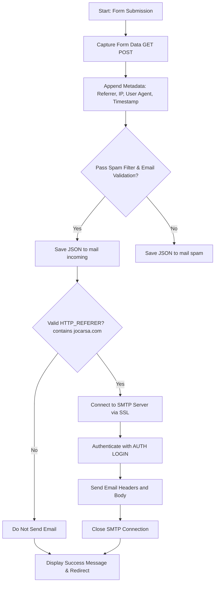

## Detailed Workflow

1. **Form Submission**  
   The system receives data through a form via GET or POST methods.

2. **Data Collection & Metadata**  
   The submitted form data is captured. Additional metadata is appended:
   - HTTP referrer
   - Visitor IP address
   - User Agent string
   - Timestamp in a human-readable format

3. **Spam Filtering & Email Validation**  
   The system applies two key checks:  
   - **Spam Filter:** Scans all submitted values for spam keywords (loaded from `spamfilter.txt`).  
   - **Email Validation:** Validates email fields by checking that the email has a proper domain format and that the top-level domain (TLD) exists in the IANA list.  
   Depending on these checks, the submission is flagged for further processing.

4. **Data Storage**  
   - If the submission fails either check, the JSON data is saved in the `mail/spam` folder.
   - If the submission passes both checks, the data is saved in the `mail/incoming` folder.

5. **Email Sending Condition**  
   Only submissions that pass validation and come from a valid HTTP referrer (containing `jocarsa.com`) proceed to trigger the SMTP email sending process:
   - The system establishes an SSL connection to the SMTP server.
   - It authenticates using `AUTH LOGIN`.
   - The email (with HTML content) is sent.
   - Finally, the connection is closed.

6. **User Feedback**  
   After processing, a success message is shown and the user is redirected to the main domain.

## Updated Flow Chart

Below is the updated Mermaid flow chart that accurately reflects the conditional operations performed by the system:

