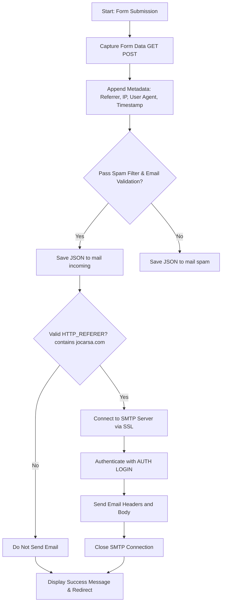

# Jocarsa Email System

## Descripción General

Este proyecto es un sistema de envío y gestión de correos electrónicos diseñado para facilitar la comunicación a través de formularios web. Incluye funcionalidades como filtrado de spam y autenticación de usuarios.

## Estructura del Directorio

/var/www/html/jocarsa-email
├── README.md             # Documentación del proyecto
├── config.php            # Configuración del servidor SMTP
├── enviacorreo.php       # Script para enviar correos electrónicos
├── index.php             # Interfaz web para gestionar correos
└── spamfilter.txt        # Lista de palabras clave para filtrar spam

## Configuración

1. **Configuración SMTP:**
   - Edita el archivo `config.php` para establecer las credenciales del servidor SMTP.

2. **Dependencias:**
   - Asegúrate de tener PHP instalado en tu servidor.
   - Extensiones necesarias: `openssl`, `fileinfo`.

## Uso

1. **Envío de Correos:**
   - Accede al formulario web para enviar correos.
   - Los correos se almacenan en la carpeta `mail/incoming` o `mail/spam` dependiendo del filtro de spam.

2. **Interfaz Web:**
   - Accede a `index.php` para gestionar los correos recibidos.
   - Autentícate con las credenciales definidas en el script.

## Funcionalidades

- **Filtro de Spam:**
  - Filtra correos basados en palabras clave definidas en `spamfilter.txt`.

- **Autenticación de Usuarios:**
  - Sistema de login para acceder a la interfaz de gestión de correos.

- **Gestión de Correos:**
  - Visualiza y elimina correos directamente desde la interfaz web.

## Contribuciones

Si deseas contribuir al proyecto, por favor sigue las mejores prácticas de desarrollo y envía tus pull requests con una descripción clara de los cambios realizados.

## Licencia

Este proyecto está licenciado bajo la Licencia MIT. Consulta el archivo `LICENSE` para más detalles.

