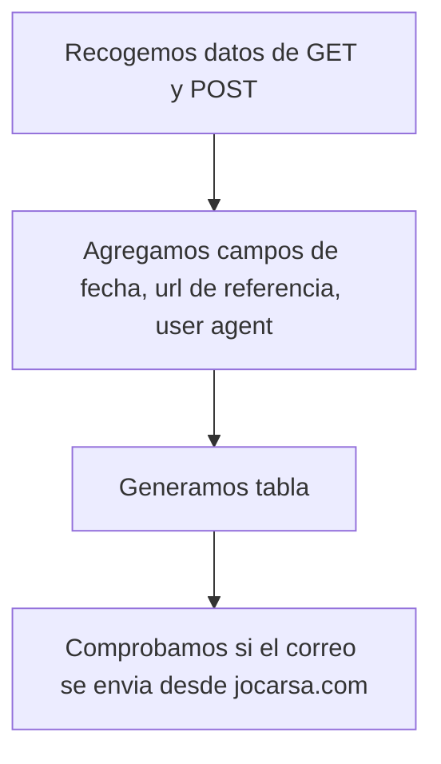

# jocarsa-email

# Diagrama de comportamiento

```mermaid
    graph TD;
    RecogerDatos[Recogemos datos de GET y POST] --> AgregarCampos[Agregamos campos de fecha, url de referencia, user agent];
    AgregarCampos --> GenerarTabla[Generamos tabla];
    GenerarTabla --> ComprobarDominio[Comprobamos si el correo se envia desde jocarsa.com];
```
